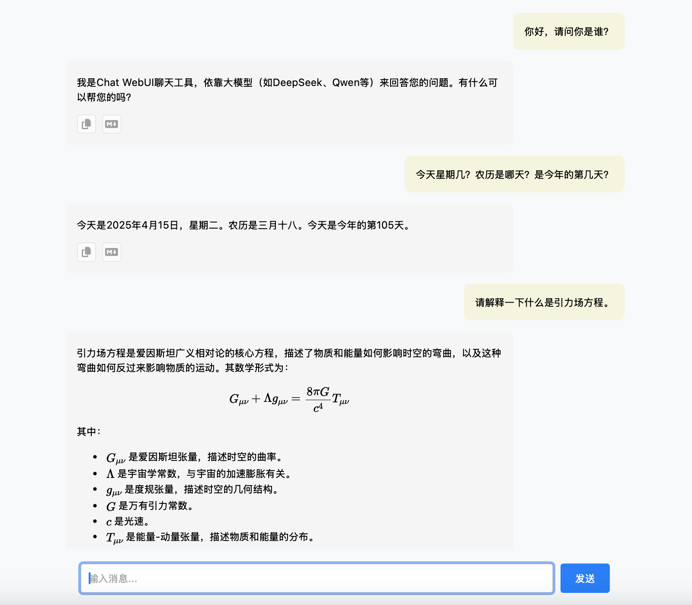

# ChatWebUI

A feature-rich web-based chat interface that acts as a frontend for OpenAI-compatible APIs, with a comprehensive administrator panel for configuration management.

## Features

### Core Chat Features
*   Connects to any OpenAI-compatible API endpoint
*   Supports streaming responses for real-time interaction
*   Renders Markdown and LaTeX in chat messages
*   Injects configurable system prompts (supports date placeholder `{{date}}`)
*   "Copy" button for rich text message content
*   "Copy Markdown" button for raw Markdown message content
*   Optional logging of raw API responses
*   Simple, clean interface

### Administrator Panel Features
*   **Secure Admin Setup**: Initial password setup with bcrypt hashing
*   **Session-based Authentication**: Secure login/logout with express-session
*   **Multi-Profile Configuration**: Create and manage multiple API configuration profiles
*   **Dynamic Profile Switching**: Switch between different API providers without server restart
*   **Configuration Management**: Web-based interface for managing API settings
*   **Password Management**: Change admin password through the web interface
*   **Security Features**: CSRF protection and secure session handling

## Quick Start

### First Time Setup

1. **Clone and Install**:
   ```bash
   git clone https://github.com/iXimNet/ChatWebUI.git
   cd ChatWebUI
   npm install
   ```

2. **Environment Setup**:
   ```bash
   cp .env.example .env
   # Edit .env file to set PORT and SESSION_SECRET
   ```

3. **Start the Server**:
   ```bash
   npm start
   # or for development:
   npm run dev
   ```

4. **Initial Admin Setup**:
   - Navigate to `http://localhost:3000` (or your configured port)
   - You'll be redirected to the setup page to create an admin password
   - Complete the setup and restart the server

5. **Configure API Profiles**:
   - Login at `http://localhost:3000/login.html`
   - Access the admin panel at `http://localhost:3000/admin`
   - Create and configure your API profiles

## Configuration

### Environment Variables (.env)

The `.env` file contains minimal server configuration:

```dotenv
# Server port (optional, defaults to 3000)
PORT=3000

# Admin password hash (automatically set during setup)
ADMIN_PASSWORD_HASH=

# Session secret for secure sessions (required)
SESSION_SECRET=your_strong_session_secret_here
```

### API Configuration (config.json)

API configurations are managed through the admin panel and stored in `config.json`:

```json
{
    "profiles": {
        "OpenAI": {
            "API_BASE_URL": "https://api.openai.com/v1",
            "API_KEY": "your_openai_api_key",
            "MODEL_NAME": "gpt-4",
            "API_SYSTEM_PROMPT": "You are a helpful assistant. Today's date is {{date}}.",
            "API_LOG": false
        },
        "Custom Provider": {
            "API_BASE_URL": "https://your-api-endpoint.com/v1",
            "API_KEY": "your_api_key",
            "MODEL_NAME": "custom-model",
            "API_SYSTEM_PROMPT": "Custom system prompt here.",
            "API_LOG": true
        }
    },
    "activeProfile": "OpenAI"
}
```

## Admin Panel Usage

### Accessing the Admin Panel

1. Navigate to `http://localhost:PORT/login.html`
2. Enter your admin password
3. Access the admin dashboard at `http://localhost:PORT/admin`

### Managing Configuration Profiles

**Create a New Profile:**
- Click "Add New Profile" in the admin dashboard
- Fill in the configuration details:
  - **API_BASE_URL**: The base URL of your API endpoint
  - **API_KEY**: Your API key for authentication
  - **MODEL_NAME**: The model to use (e.g., gpt-4, gpt-3.5-turbo)
  - **API_SYSTEM_PROMPT**: System prompt (supports `{{date}}` placeholder)
  - **API_LOG**: Enable/disable API response logging

**Edit Existing Profiles:**
- Click the "Edit" button next to any profile
- Modify settings and save changes

**Switch Active Profile:**
- Click "Activate" next to the profile you want to use
- Changes take effect immediately without server restart

**Delete Profiles:**
- Click "Delete" next to profiles you no longer need
- Active profiles cannot be deleted (switch to another first)

### Security Features

- **Password Protection**: All admin functions require authentication
- **Session Management**: Secure sessions with configurable timeouts
- **CSRF Protection**: Protection against cross-site request forgery
- **Secure Cookies**: HttpOnly, SameSite, and Secure cookie flags

## API Endpoints

### Public Endpoints
- `GET /` - Main chat interface
- `POST /api/chat` - Chat API proxy (uses active profile configuration)

### Admin Endpoints (Authentication Required)
- `GET /admin` - Admin dashboard
- `GET /admin/profiles` - Get all profiles and active profile
- `POST /admin/profiles` - Create new profile
- `PUT /admin/profiles/:name` - Update existing profile
- `DELETE /admin/profiles/:name` - Delete profile
- `POST /admin/profiles/:name/activate` - Set profile as active
- `POST /admin/change-password` - Change admin password
- `POST /admin/logout` - Logout

### Setup Endpoints
- `GET /setup.html` - Initial setup page (only when no admin password set)
- `POST /admin/setup-password` - Set initial admin password

## File Structure

```
ChatWebUI/
├── server.js              # Main server file
├── package.json           # Dependencies and scripts
├── .env                   # Environment configuration
├── .env.example          # Environment template
├── config.json           # API profiles (created automatically)
├── public/               # Static web files
│   ├── index.html        # Main chat interface
│   ├── login.html        # Admin login page
│   ├── admin.html        # Admin dashboard
│   ├── setup.html        # Initial setup page
│   ├── script.js         # Chat interface logic
│   ├── login.js          # Login page logic
│   ├── admin_dashboard.js # Admin panel logic
│   └── style.css         # Styling
└── README.md             # This file
```

## Development

### Running in Development Mode

```bash
npm run dev  # Uses nodemon for auto-restart
```

### Dependencies

- **express**: Web server framework
- **bcryptjs**: Password hashing
- **express-session**: Session management
- **csurf**: CSRF protection
- **cookie-parser**: Cookie parsing middleware
- **cors**: Cross-origin resource sharing
- **dotenv**: Environment variable loading
- **http-proxy-middleware**: API proxying
- **marked**: Markdown rendering

## Security Considerations

1. **Strong Session Secret**: Use a cryptographically strong session secret
2. **HTTPS in Production**: Always use HTTPS in production environments
3. **Regular Password Updates**: Change admin passwords regularly
4. **API Key Security**: Store API keys securely and rotate them periodically
5. **Access Control**: Limit access to the admin panel to authorized users only

## Troubleshooting

### Common Issues

**Server won't start:**
- Check if the port is already in use
- Verify `.env` file configuration
- Ensure all dependencies are installed

**Can't access admin panel:**
- Complete the initial setup first
- Check if you're using the correct admin password
- Clear browser cookies and try again

**API requests failing:**
- Verify the active profile configuration
- Check API key validity
- Ensure the API endpoint is accessible

## Usage


Type your message in the input box at the bottom and press Enter or click the Send button. The assistant's response will appear in the chat window. Use the copy buttons on assistant messages to copy the content.

## License

This project is open source. Please check the repository for license details.
